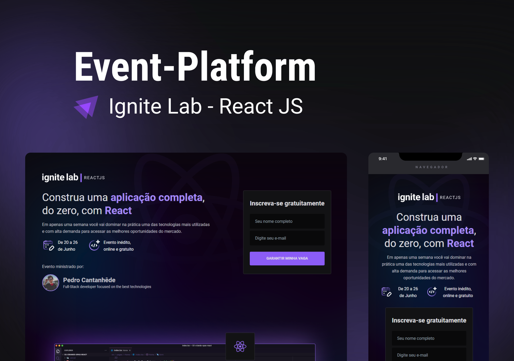
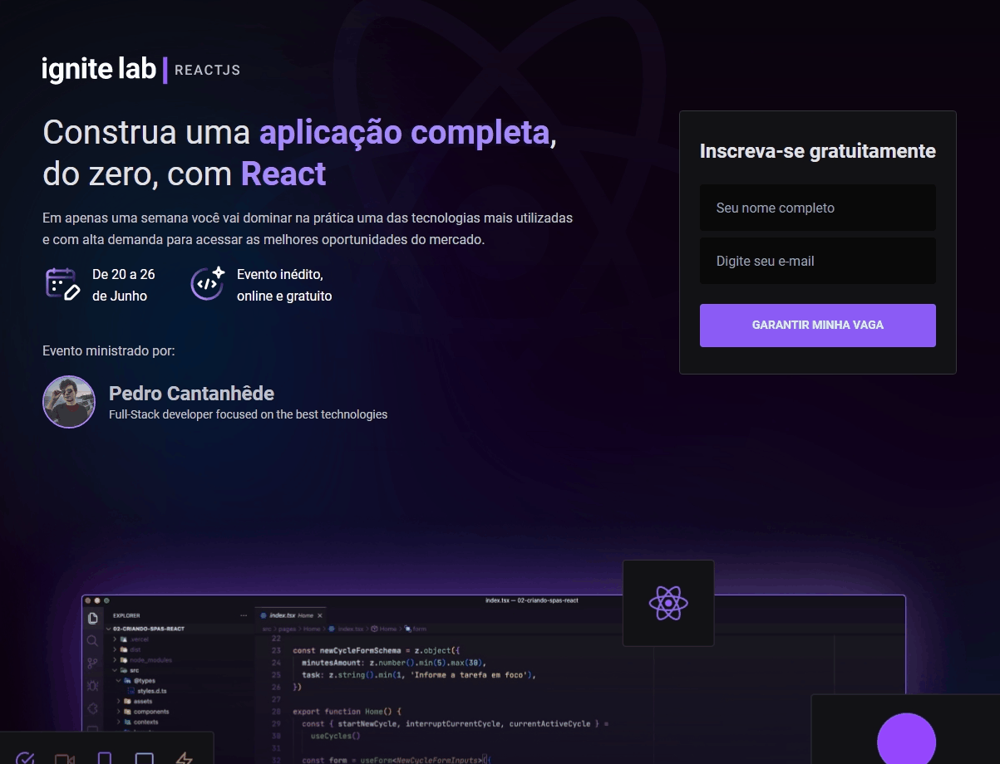
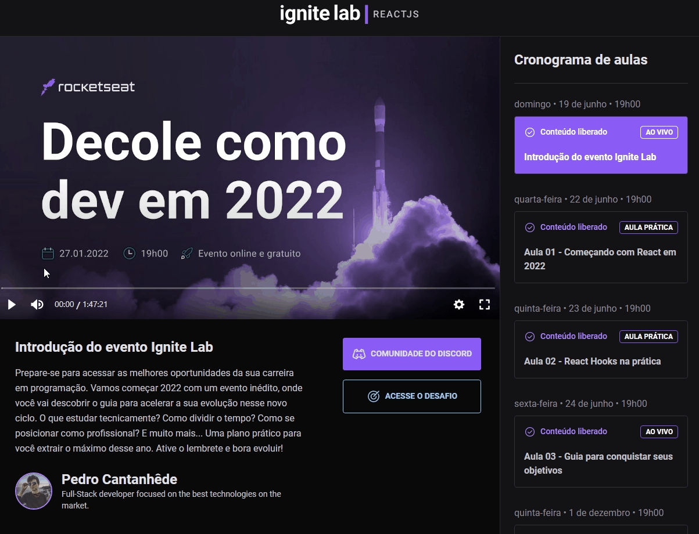
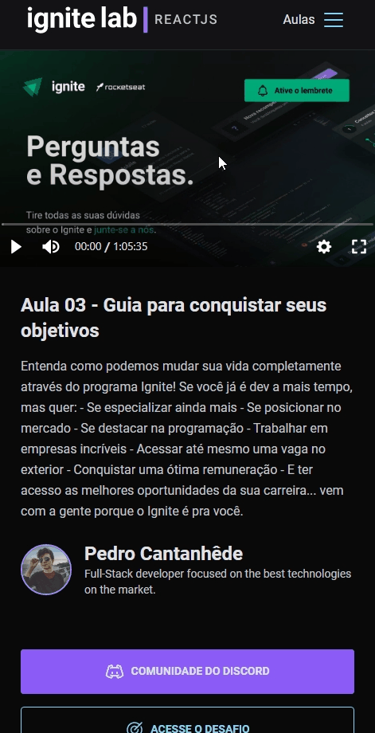
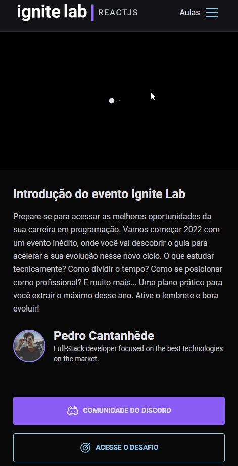
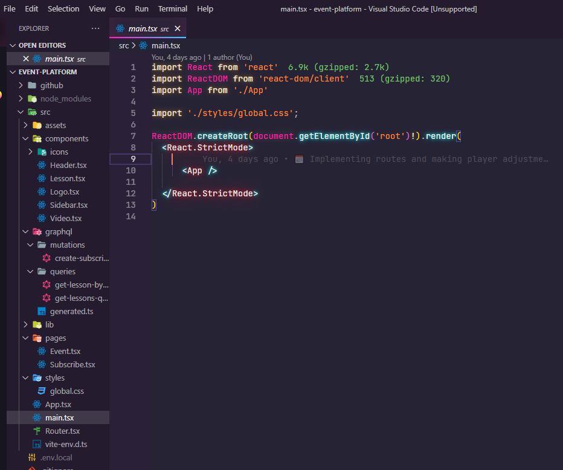

<h1 align="center">
    
</h1>

<div align="center">
    <h3> 🟣 Construa uma aplicação completa, do zero, com React. 🟣 </h3>
    <a href="https://rocketseat.com.br/" target="_blank">
      
    </a>
    <a href="https://github.com/PedroCantanhede" target="_blank">
      
    </a>
     
    
    
</div>

# Ignite Lab

Essa aplicação desenvolvida no Ignite Lab consiste em uma plataforma de evento, onde o usuário se cadastra e consegue acessar as aulas com conteúdos que são liberados gradualmente, além de ter acesso a desafios e uma comunidade no discord.

<p align="center">
  
</p>

# 🔨 Tecnologias

💻 React

💻 TypeScript

💻 Node JS

💻 Vite

💻 GraphQL

💻 Apollo GraphQL

💻 GraphCMS

💻 Tailwind CSS

## :camera: Veja:

### Aplicação Desktop





### Aplicação Mobile




### Código:



## :rocket: Instalação

```bash
# Clone o repositório
$ git clone https://github.com/PedroCantanhede/Event-Platform.git

# Entre na pasta do projeto
$ cd event-platform

# Instale as dependências
$ npm install / yarn install

# Execute a aplicação
$ npm run dev / yarn dev

# Abra o projeto na porta: 3000 - acessando: http://localhost:3000
```
## 🔖 Layout

Você pode visualizar o layout do projeto através [desse link](https://www.figma.com/file/PECb9Y2d1YMnGvkC5LZps0/Plataforma-de-evento---Ignite-Lab-(Community)?node-id=8%3A399). É necessário ter conta no [Figma](https://figma.com) para acessá-lo.

## :infinity: Ajuda da Rocketseat

A ajuda das aulas disponibilizadas durante a semana e a comunidade da Rocketseat foram essenciais para que eu chegasse no final do projeto. Deixo também meus agradecimentos ao professor **Diego Fernandes**.
[Venha e participe da comunidade da Rocketseat!!!](https://www.rocketseat.com.br/)
